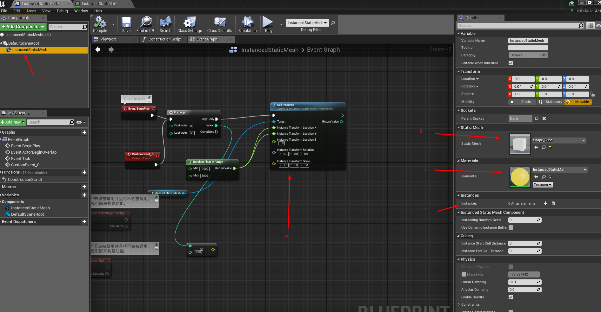

## InstancedStaticMesh Component
在unreal4中，如果想要动态添加多个StaticMeshActor时候(100-100000个)，会造成Draw Call非常高，同一个视野内渲染起来会非常慢，这个时候可以考虑使用Unreal提供的组件Instanced Static Mesh Component。这样当要spawn初成千上万个同类的StaticMesh时候，只会产生一个Draw Call的消耗。大大降低了渲染的GPU消耗。  
下面两张图片是InstancedStaticMesh运行时生成1个StaticMesh和多个的Draw Call对比
  
  
对比发现生成多个并未增加Draw Call

### 使用步骤
#### 通过蓝图创建一个Actor
#### 添加Instanced Static Mesh Component
<!--  -->
  

#### 在InstancedStaticMesh组件上设置要生成的Static Mesh和材质

图1中红色箭头2和3所指
##### 创建StaticMesh
- 编辑器方式
选中InstancedStaticMesh组件，找到Details面板，上面的Instance属性可以可视化添加StaticMesh(此生成StaticMesh属性的Mesh)
- 蓝图方式
1. 调用方法AddInstance  
此方法是将StaticMesh添加到Object坐标系下，传入的location坐标只需要是相对位置的即可
2. 调用方法AddInstance World Space  
此方法将StaticMesh添加到世界坐标系下面。

_**注意材质要设置 Used with Instance 为true的时候才有效**_
  

### 动态更改InstancedStaticMesh中物体的位置（比较消耗）
1. 通过方法Update Instance Transform来更新内部的StaticMesh位置信息  
此方法通过Instance Index来定位要更新的目标Transform

_**设置Mark Render State Dirty为true**_
 

### 通过材质来模拟位移
_敬请期待_

