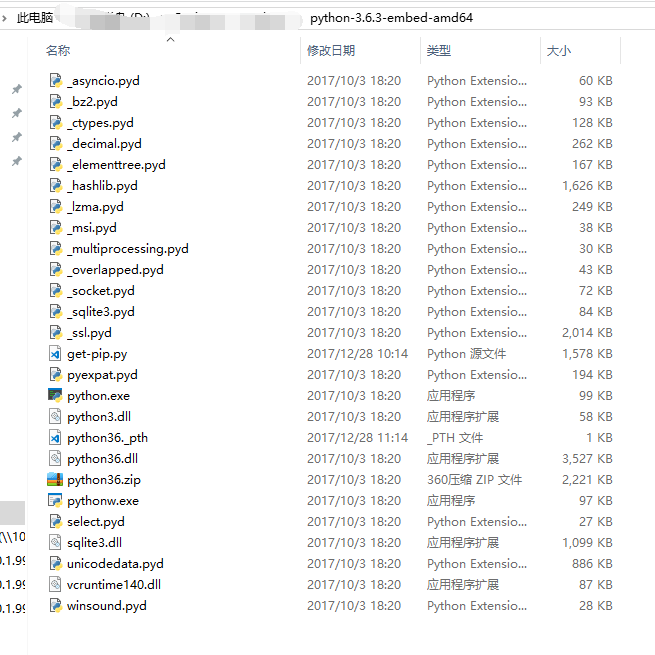

# 需求
&emsp;&emsp;有时候我们自己本机部署了python环境进行相关开发，但是想让自己开发的东西在别人机器上运行，又不想自己再去配置相应的开发环境(尤其是离线的机器上，这里以pc为主,linux等机器上docker也是OK)。  
&emsp;&emsp;在下在python3.6.3版本的时候正好看到了python embeddable版本,里面只包含了必要的运行环境,如果想用第三方包，只需要将相关的第三方包配置到具体路径下就行了。其相关包目录截图如下。

# 具体步骤
## 1.修改python36._pth

&emsp;&emsp;打开python36._pth文件将其中#import site中的#号去掉（其他有embed版本的python对应的._pth文件为pythonxx._pth）
## 2.安装pip

&emsp;&emsp;官网是说通过get-pip.py进行相关的下载安装。这里给出相应的下载链接[get-pip.py](https://bootstrap.pypa.io/get-pip.py)打开后将其内容拷贝存到本地embed目录下创建的get-pip.py文件内。  
&emsp;&emsp;然后在这个目录下执行如下命令  
`python get-pip.py`  
程序会将相关的包下载到目录内
## 3.安装第三方包
在这个目录下执行命令行 `python -m pip install 相应的包名`就会将包安装到这个目录下的Lib/site-packages中（如果没有会制动生成）和相关的可执行exe程序在Scripts目录下（如果没有会制动生成）。
## 4.注意事项
因为没有在系统中配置相应的python环境，所以要运行要将python 制定到这个embed目录下，其实自己将这个目录配置到windows的path环境中也能达到相应的效果。

# 官网对程序查找模块的阐述（Finding modules）[官网地址](https://docs.python.org/3/using/windows.html)

## 3.5. Finding modules
Python usually stores its library (and thereby your site-packages folder) in the installation directory. So, if you had installed Python to C:\Python\, the default library would reside in C:\Python\Lib\ and third-party modules should be stored in C:\Python\Lib\site-packages\.

To completely override sys.path, create a ._pth file with the same name as the DLL (python36._pth) or the executable (python._pth) and specify one line for each path to add to sys.path. The file based on the DLL name overrides the one based on the executable, which allows paths to be restricted for any program loading the runtime if desired.

When the file exists, all registry and environment variables are ignored, isolated mode is enabled, and site is not imported unless one line in the file specifies import site. Blank paths and lines starting with # are ignored. Each path may be absolute or relative to the location of the file. Import statements other than to site are not permitted, and arbitrary code cannot be specified.

Note that .pth files (without leading underscore) will be processed normally by the site module.

When no ._pth file is found, this is how sys.path is populated on Windows:

- An empty entry is added at the start, which corresponds to the current directory.
- If the environment variable PYTHONPATH exists, as described in Environment variables, its entries are added next. Note that on Windows, paths in this variable must be separated by semicolons, to distinguish them from the colon used in drive identifiers (C:\ etc.).
- Additional “application paths” can be added in the registry as subkeys of \SOFTWARE\Python\PythonCore\version\PythonPath under both the HKEY_CURRENT_USER and HKEY_LOCAL_MACHINE hives. Subkeys which have semicolon-delimited path strings as their default value will cause each path to be added to sys.path. (Note that all known installers only use HKLM, so HKCU is typically empty.)
- If the environment variable PYTHONHOME is set, it is assumed as “Python Home”. Otherwise, the path of the main Python executable is used to locate a “landmark file” (either Lib\os.py or pythonXY.zip) to deduce the “Python Home”. If a Python home is found, the relevant sub-directories added to sys.path (Lib, plat-win, etc) are based on that folder. Otherwise, the core Python path is constructed from the PythonPath stored in the registry.
- If the Python Home cannot be located, no PYTHONPATH is specified in the environment, and no registry entries can be found, a default path with relative entries is used (e.g. .\Lib;.\plat-win, etc).
If a pyvenv.cfg file is found alongside the main executable or in the directory one level above the executable, the following variations apply:

- If home is an absolute path and PYTHONHOME is not set, this path is used instead of the path to the main executable when deducing the home location.
The end result of all this is:

- When running python.exe, or any other .exe in the main Python directory (either an installed version, or directly from the PCbuild directory), the core path is deduced, and the core paths in the registry are ignored. Other “application paths” in the registry are always read.
- When Python is hosted in another .exe (different directory, embedded via COM, etc), the “Python Home” will not be deduced, so the core path from the registry is used. Other “application paths” in the registry are always read.
- If Python can’t find its home and there are no registry value (frozen .exe, some very strange installation setup) you get a path with some default, but relative, paths.

For those who want to bundle Python into their application or distribution, the following advice will prevent conflicts with other installations:

- Include a ._pth file alongside your executable containing the directories to include. This will ignore paths listed in the registry and environment variables, and also ignore site unless import site is listed.
- If you are loading python3.dll or python36.dll in your own executable, explicitly call Py_SetPath() or (at least) Py_SetProgramName() before Py_Initialize().
- Clear and/or overwrite PYTHONPATH and set PYTHONHOME before launching python.exe from your application.
- If you cannot use the previous suggestions (for example, you are a distribution that allows people to run python.exe directly), ensure that the landmark file (Lib\os.py) exists in your install directory. (Note that it will not be detected inside a ZIP file, but a correctly named ZIP file will be detected instead.)

These will ensure that the files in a system-wide installation will not take precedence over the copy of the standard library bundled with your application. Otherwise, your users may experience problems using your application. Note that the first suggestion is the best, as the other may still be susceptible to non-standard paths in the registry and user site-packages.

Changed in version 3.6:
- Adds ._pth file support and removes applocal option from pyvenv.cfg.
- Adds pythonXX.zip as a potential landmark when directly adjacent to the executable.

Deprecated since version 3.6:
Modules specified in the registry under Modules (not PythonPath) may be imported by importlib.machinery.WindowsRegistryFinder. This finder is enabled on Windows in 3.6.0 and earlier, but may need to be explicitly added to sys.meta_path in the future.

## 3.6. Additional modules
Even though Python aims to be portable among all platforms, there are features that are unique to Windows. A couple of modules, both in the standard library and external, and snippets exist to use these features.

The Windows-specific standard modules are documented in MS Windows Specific Services.

# python官网对 python Embedded 的相关阐述[官网链接地址](https://docs.python.org/3/using/windows.html)

## 3.8. Embedded Distribution
* New in version 3.5.

The embedded distribution is a ZIP file containing a minimal Python environment. It is intended for acting as part of another application, rather than being directly accessed by end-users.

When extracted, the embedded distribution is (almost) fully isolated from the user’s system, including environment variables, system registry settings, and installed packages. The standard library is included as pre-compiled and optimized .pyc files in a ZIP, and python3.dll, python36.dll, python.exe and pythonw.exe are all provided. Tcl/tk (including all dependants, such as Idle), pip and the Python documentation are not included.
`
Note The embedded distribution does not include the Microsoft C Runtime and it is the responsibility of the application installer to provide this. The runtime may have already been installed on a user’s system previously or automatically via Windows Update, and can be detected by finding ucrtbase.dll in the system directory.
`

Third-party packages should be installed by the application installer alongside the embedded distribution. Using pip to manage dependencies as for a regular Python installation is not supported with this distribution, though with some care it may be possible to include and use pip for automatic updates. In general, third-party packages should be treated as part of the application (“vendoring”) so that the developer can ensure compatibility with newer versions before providing updates to users.

The two recommended use cases for this distribution are described below.

### 3.8.1. Python Application
An application written in Python does not necessarily require users to be aware of that fact. The embedded distribution may be used in this case to include a private version of Python in an install package. Depending on how transparent it should be (or conversely, how professional it should appear), there are two options.

Using a specialized executable as a launcher requires some coding, but provides the most transparent experience for users. With a customized launcher, there are no obvious indications that the program is running on Python: icons can be customized, company and version information can be specified, and file associations behave properly. In most cases, a custom launcher should simply be able to call Py_Main with a hard-coded command line.

The simpler approach is to provide a batch file or generated shortcut that directly calls the python.exe or pythonw.exe with the required command-line arguments. In this case, the application will appear to be Python and not its actual name, and users may have trouble distinguishing it from other running Python processes or file associations.

With the latter approach, packages should be installed as directories alongside the Python executable to ensure they are available on the path. With the specialized launcher, packages can be located in other locations as there is an opportunity to specify the search path before launching the application.

### 3.8.2. Embedding Python
Applications written in native code often require some form of scripting language, and the embedded Python distribution can be used for this purpose. In general, the majority of the application is in native code, and some part will either invoke python.exe or directly use python3.dll. For either case, extracting the embedded distribution to a subdirectory of the application installation is sufficient to provide a loadable Python interpreter.

As with the application use, packages can be installed to any location as there is an opportunity to specify search paths before initializing the interpreter. Otherwise, there is no fundamental differences between using the embedded distribution and a regular installation.
# python pip的手动安装[链接](https://pip.pypa.io/en/stable/installing/)

# python embed 安装pip失败原因的探讨[链接](https://github.com/pypa/get-pip/issues/7)
这篇链接要注意的是 cprogrammer1994这个人对的讲解（官网文档也提到过类似的解决方法） python36._pth import site 前面的#号注释掉

