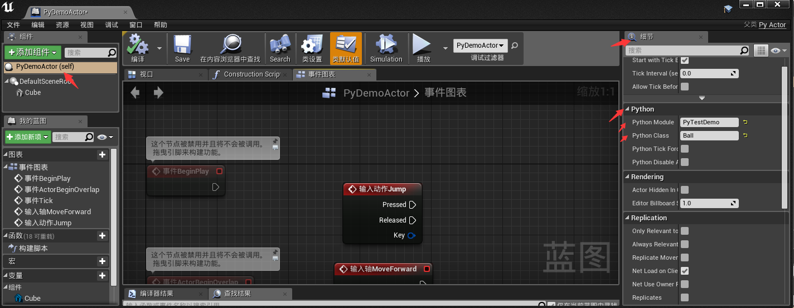
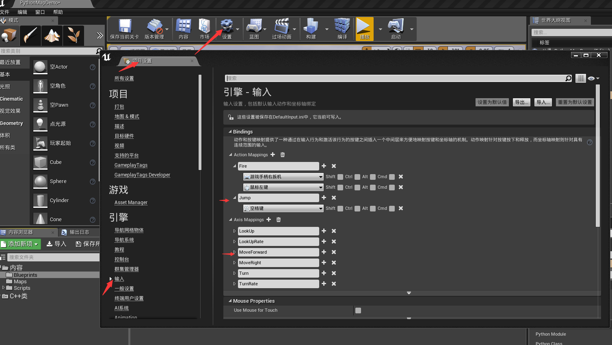
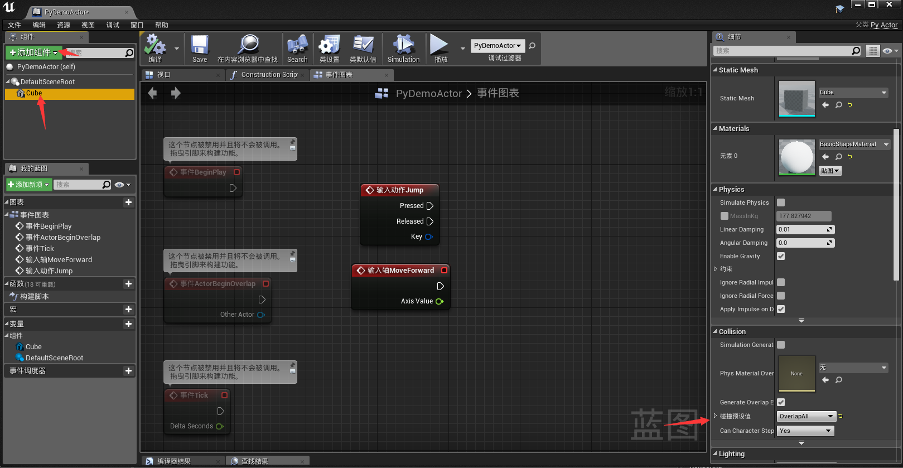
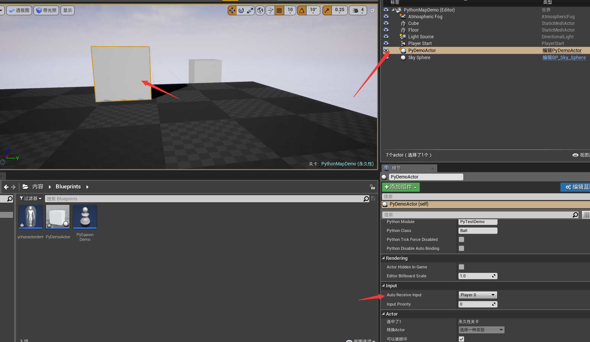

# 通过python创建一个新的blueprint class

在这篇我们通过python去创建一个新的Actor(去取代c++或者buleprints)。
这里利用代理python class的方式去描述UE4的api。一旦你熟悉了这种方式，在后面你就可以用本地的子类api。

## 1.在内容浏览器中点击”添加新项“ 然后选择 “蓝图类”
## 2.在蓝图类面板中的所有类搜索框中输入PyActor
## 3.修改其创建的blueprint class （这里我命名为PythonDemoAcotr）

下面在内容浏览器中创建一个文件夹（Scripts）用于存放所有的python modules.
创建一个Python脚本（我这命名为PyTestDemo）
`
import unreal_engine as ue

ue.log('Hello i am a Python module')
class Ball:
    def begin_play(self):
        self.uobject.bind_event('OnActorBeginOverlap', self.manage_overlap)
        self.uobject.bind_action('Jump', ue.IE_PRESSED, self.jump_test)
        self.uobject.bind_key('K', ue.IE_PRESSED, self.you_pressed_K)
        self.uobject.bind_axis('MoveForward', self.move_forward)
        
    def jump_test(self):
        ue.log_warning('jump')
    def manage_overlap(self, me, other):
        ue.print_string('overlapping ' + other.get_name())
        
    def you_pressed_K(self):
        ue.log_warning('you pressed K')
        
    def move_forward(self, amount):
        ue.print_string('axis value: ' + str(amount))   

	
`
编辑上面创建的蓝图（PythonDemoActor）,在其细节部分能看到Python组件，输入Python Module和Python Class，然后点击编译。

## 运行前注意事项
这里注意的是在项目设置要设置相应的输入控制如下图

- 注意：1因为调用OnActorBeginOverlap这个，我这里的Actor加了一个正方体，所以正方体要的Collision中的碰撞设置要选OverlapAll

- 注意：2因为默认的Actor输入组件中的Auto Receive Input是为Disabled（我这里是UE4.17）所哟要将其改为相应的输入设置（我这里场景中只有一个相关输入，所以设置为Player0）

